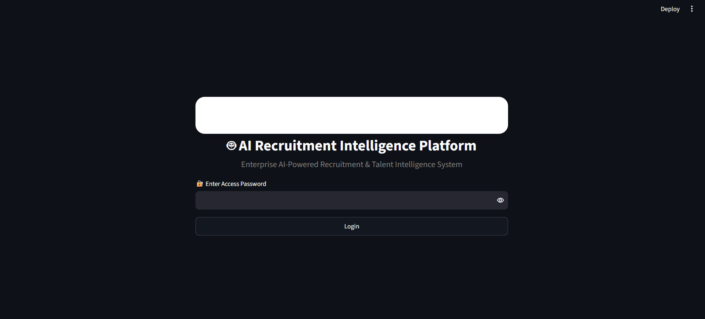

# 🚀 [Tips Hindawi](https://www.tipshindawi.com/) Challenge (June–July) 2026

> 🏆 This repository is my official submission for the **Tips Hindawi Challenge (June–July 2026)**.

## 👤 Participant

| Field | Value |
| ---------------- | ------------------------------------ |
| Full Name | Menna Allah Walid |
| Project Name | AI Recruitment Intelligence Platform |
| GitHub Username | menna96216 |
| Challenge Batch | June–July 2026 |
| Training Program | Large Language Models (LLMs) Program |
| Organization | **Edrak for AI** |

**GitHub Profile:** https://github.com/menna96216

---

# 📖 Project Overview

The **AI Recruitment Intelligence Platform** is an end-to-end intelligent hiring system that automates and enhances the recruitment process using Large Language Models (LLMs), Retrieval-Augmented Generation (RAG), and a modular Multi-Agent AI architecture.

The platform assists HR teams throughout the recruitment lifecycle, from resume screening to the final hiring decision. It automatically parses resumes, evaluates ATS compatibility, analyzes job descriptions, identifies skill gaps, generates personalized technical interviews, evaluates candidate responses, creates comprehensive interview reports, recommends hiring decisions, and produces personalized career development plans.

The platform also supports ranking multiple candidates for the same job position, enabling recruiters to compare applicants efficiently and make data-driven hiring decisions.

---

# 🏗️ Project Architecture

The platform follows a modular Multi-Agent AI architecture where each intelligent agent performs a dedicated task in the recruitment workflow.

### AI Agents

* Resume Parsing Agent
* Job Analysis Agent
* ATS Scoring Agent
* Interview Configuration Agent
* Interview Question Generator Agent
* Answer Evaluation Agent
* Interview Report Agent
* Final Decision Agent
* Career Development Agent

---

# ✨ Features

* 🤖 AI-powered Resume Parsing
* 📄 Automated ATS Resume Scoring
* 🎯 Job Description Analysis
* 👤 Candidate Profile Generation
* 🔍 Skill Gap Detection
* 🧠 Retrieval-Augmented Generation (RAG)
* 💬 AI Interview Configuration
* ❓ AI Technical Interview Question Generation
* ✅ AI Answer Evaluation
* 📊 Comprehensive Interview Report Generation
* 🎯 AI Hiring Recommendation
* 📈 Personalized Career Development Plan
* 🏆 Multi-Candidate Ranking
* 👨‍💼 HR Dashboard
* 👤 Candidate Dashboard
* 🔐 Authentication System
* 💾 MongoDB Database Integration
* 📑 JSON Report Generation and Export

---

# 🛠️ Technologies Used

## Programming Language

* Python

## AI & Machine Learning

* Large Language Models (LLMs)
* Hugging Face Transformers
* LangGraph
* Retrieval-Augmented Generation (RAG)
* Prompt Engineering
* Sentence Transformers

## Frameworks

* Streamlit

## Databases

* MongoDB
* SQLite

## Vector Database

* FAISS

## Libraries

* PyTorch
* Transformers
* Accelerate
* Pydantic
* Pandas
* NumPy
* PyMongo
* python-dotenv
* JSON

## Development Tools

* Git
* GitHub
* Visual Studio Code

---

# ⚙️ Installation

## 1. Clone the Repository

```bash
git clone https://github.com/menna96216/AI-Recruitment-Intelligence-Platform.git

cd AI-Recruitment-Intelligence-Platform
```

## 2. Create a Virtual Environment

```bash
python -m venv venv
```

### Windows

```bash
venv\Scripts\activate
```

### Linux / macOS

```bash
source venv/bin/activate
```

## 3. Install Dependencies

```bash
pip install -r requirements.txt
```

## 4. Configure Environment Variables

Create a `.env` file and add the required environment variables.

Example:

```text
MONGO_URI=your_connection_string
```

Also add any required API keys if your project uses external LLM services.

## 5. Run the Application

```bash
streamlit run app.py
```

---

# 🚀 Usage

1. Login to the platform.
2. Access the Home Dashboard.
3. Upload one or multiple candidate resumes.
4. Upload or create a Job Description.
5. Automatically parse resumes.
6. Generate ATS compatibility reports.
7. Rank multiple candidates based on AI evaluation.
8. Select the best candidate.
9. Generate interview configuration.
10. Generate personalized technical interview questions.
11. Conduct the interview.
12. Evaluate candidate answers using AI.
13. Generate a comprehensive interview report.
14. Generate the final hiring recommendation.
15. Generate a personalized career development plan.
16. Store recruitment data in MongoDB.

---

# 📸 Demo

The following demonstration shows the complete AI-powered recruitment workflow.

### Project Demo

🎥 **Demo Video**

Click the image below to watch the complete project demonstration.

[](https://drive.google.com/file/d/1Mq0EeQpdWJYnUA2yYcI3hoiIvxzhrcpU/view?usp=sharing)

The demonstration includes:

* User Login
* Home Dashboard
* Multi-Candidate Ranking
* Resume Parsing
* ATS Analysis
* Candidate Comparison
* HR Dashboard
* AI Interview Generation
* Candidate Answer Evaluation
* Interview Report
* Final Hiring Recommendation
* Career Development Plan
* MongoDB Database Storage

---

# 📈 Results

The platform successfully automates multiple stages of the recruitment lifecycle.

### Key Outcomes

* Automated Resume Parsing
* AI-powered ATS Evaluation
* Intelligent Skill Gap Analysis
* AI-based Multi-Candidate Ranking
* Personalized Technical Interview Generation
* Automatic Candidate Answer Evaluation
* Comprehensive Interview Reporting
* AI-assisted Hiring Recommendation
* Personalized Career Development Roadmap
* MongoDB Data Storage
* End-to-End Recruitment Automation

---

# 🔮 Future Improvements

* Support multiple LLM providers.
* Add speech-to-text interview support.
* Integrate real-time video interview analysis.
* Support multilingual recruitment.
* Improve RAG using hybrid search.
* Add advanced HR analytics dashboards.
* Integrate email notifications.
* Deploy using Docker and Kubernetes.
* Deploy on cloud platforms such as AWS or Google Cloud.
* Support multi-company recruitment environments.

---

# 📚 About the Challenge

This project was developed as part of the **Tips Hindawi Challenge (June–July 2026)**.

**Tips Hindawi** is the internships department of **Edrak for AI**, and the challenge encourages participants to build real-world AI applications, apply practical engineering skills, and showcase their projects through GitHub.

This project demonstrates the practical application of Large Language Models (LLMs), Retrieval-Augmented Generation (RAG), Multi-Agent AI systems, Prompt Engineering, and modern AI engineering techniques to solve real-world recruitment challenges.

For more information about the challenge, training programs, and upcoming batches, visit the official **Tips Hindawi** website.

---

# 📄 License

This project is shared for educational, research, and portfolio purposes.

© 2026 Menna Allah Walid. All rights reserved.
